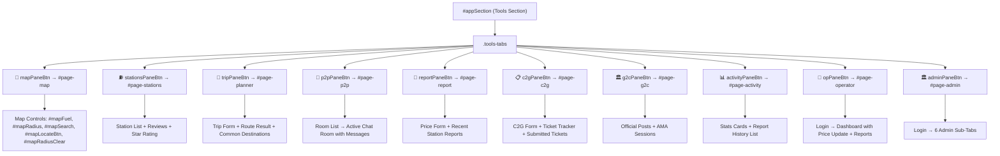

# MafutaWatch Uganda — Site Map & Architecture

> **File:** `docs/05_SITE_MAP.md`  
> **Source:** `app/index.html` (1621 lines), `app/js/data.js` (117 lines), `app/js/app.js` (2286 lines)  
> **DB Store Key:** `mafuta_watch_v2` (localStorage)

---

## 1. Navigation Tree

### 1.1 Main Tab System

The application uses a flat tab-bar with 10 tabs managed by `switchPage(pane)` (`app.js:107`). Each tab corresponds to a `<div class="tools-pane" id="page-{pane}">` and a `<button class="tools-tab" data-pane="{pane}">`.



### 1.2 Admin Sub-Navigation (`#adminDash`)

Activated by admin login (`admin123`). Uses `.admin-tab` buttons with `data-admin-tab` attribute.

| Admin Tab | Pane ID | Functions Called |
|-----------|---------|-----------------|
| 📊 Dashboard | `#adminPane-dashboard` | `renderAdminDash()`, `renderSLATimers()` |
| 🚨 Fraud Queue | `#adminPane-fraud` | `renderFraudQueue()` |
| 🏪 Station Mgmt | `#adminPane-stations` | `renderKYCPipeline()`, `renderWhitelist()` |
| 📋 Audit Trail | `#adminPane-audit` | `renderAuditTrail()` |
| ⚙️ System Config | `#adminPane-config` | `renderHierarchyTree()`, `renderBroadcasts()` |
| 🔑 API Console | `#adminPane-api` | `renderAPITokens()` |

**Station Mgmt sub-tabs:** `.admin-sub-tab[data-station-tab]` — `kyc` / `whitelist`  
**System Config sub-tabs:** `.admin-sub-tab[data-config-tab]` — `hierarchy` / `broadcast`

### 1.3 Operator Sub-Navigation (`#page-operator`)

Two states:
- **Login state:** `#opLogin` (visible by default) — phone + OTP (`123456`)
- **Dashboard state:** `#opDashboard` (hidden by default) — station selector, price cards, update form, crowd reports, consistency alert

### 1.4 Static Sections (always visible, outside tab system)

| Section | Element ID / Class | Purpose |
|---------|--------------------|---------|
| Navbar | `#navbar` | Top nav with trust badge, notification bell, hamburger |
| Breadcrumb | `.gov-breadcrumb` | Govt directory breadcrumb (fixed below navbar) |
| Institutional Profile | `.gov-institutional` | Entity header, contact grid |
| Leadership Framework | `.gov-leadership` | 3 leader cards with details |
| Hero | `#hero` | CTA buttons, live feed ticker, broadcast input, stats card |
| Tri-Hub | `.trihub-section` | 3 hub cards (P2P, C2G, G2C) with CTAs |
| Metrics | `.metrics-section` | 3 metric cards + dual CTAs |
| Price Cap Matrix | `#priceCapMatrix` | Nationwide district cap table (static HTML) |
| Partners | `.partners-section` | Scrolling partner logos |
| Live Analytics | `.section` (green-mid) | Region cards + mini map |
| Station Modal | `#stationModal` | Overlay sheet for station details |
| Toast | `#toast` | Global notification snackbar |

---

## 2. Component Hierarchy

```mermaid
graph TB
    Body["<body>"]
    Body --> Navbar["#navbar"]
    Navbar --> Brand[".navbar-brand"]
    Navbar --> Links[".navbar-links"]
    Links --> TrustBadge["#trustBadge"]
    Links --> NotifPanel["#notifPanel → #notifBadge"]
    Links --> Tabs[".tools-tab x10"]
    Links --> Hamburger[".hamburger"]

    Body --> Breadcrumb[".gov-breadcrumb"]
    Body --> GovInst[".gov-institutional"]
    GovInst --> EntityHeader[".gov-entity-header"]
    GovInst --> ContactGrid[".gov-contact-grid"]

    Body --> GovLeadership[".gov-leadership"]
    GovLeadership --> LeaderCards[".gov-leader-card x3"]

    Body --> Hero["#hero"]
    Hero --> HeroLeft[".hero-left"]
    HeroLeft --> HeroActions[".hero-actions"]
    HeroLeft --> HeroFeed["#heroFeed → #feedTicker"]
    HeroLeft --> HeroEntry["#broadcastInput, #sendBroadcastBtnHero"]
    Hero --> HeroRight[".hero-right"]
    HeroRight --> StatsCard[".hero-stats-card"]

    Body --> TriHub[".trihub-section"]
    TriHub --> HubP2P["#hubP2P"]
    TriHub --> HubC2G["#hubC2G"]
    TriHub --> HubG2C["#hubG2C"]

    Body --> Metrics[".metrics-section"]
    Body --> GovPriceCap["#priceCapMatrix"]
    Body --> Partners[".partners-section"]
    Body --> LiveAnalytics[".section bg-green-mid"]
    LiveAnalytics --> RegionCards["#regionCards"]
    LiveAnalytics --> MiniMap["#analyticsMiniMap"]

    Body --> AppSection["#appSection"]
    AppSection --> MainContent["#mainContent"]

    MainContent --> PageMap["#page-map"]
    PageMap --> MapWrapper["#mapWrapper"]
    MapWrapper --> Map["#map (Leaflet)"]
    MapWrapper --> MapControls[".map-top-controls"]
    MapControls --> MapFuel["#mapFuel"]
    MapControls --> MapRadius["#mapRadius"]
    MapControls --> MapSearch["#mapSearch"]
    MapControls --> MapResultCount["#mapResultCount"]
    MapControls --> MapLocate["#mapLocateBtn"]
    MapControls --> MapRadiusClear["#mapRadiusClear"]

    MainContent --> PageStations["#page-stations"]
    PageStations --> ListSearch["#listSearch"]
    PageStations --> ListFuel["#listFuel"]
    PageStations --> StationList["#stationList"]
    PageStations --> ReviewSection["#reviewSection"]
    ReviewSection --> ReviewStation["#reviewStation"]
    ReviewSection --> StarRating[".star-rating"]
    ReviewSection --> Issues["#issueLines, #issuePumps, #issueFuel"]
    ReviewSection --> ReviewText["#reviewText"]
    ReviewSection --> RecentReviews["#recentReviews"]

    MainContent --> PagePlanner["#page-planner"]
    PagePlanner --> TripForm[".tool-card"]
    TripForm --> TripFrom["#tripFrom"]
    TripForm --> TripTo["#tripTo"]
    TripForm --> TripVehicle["#tripVehicle"]
    TripForm --> CalcTripBtn["#calcTripBtn"]
    PagePlanner --> TripResult["#tripResult"]
    PagePlanner --> CommonDests["#commonDests"]

    MainContent --> PageP2P["#page-p2p"]
    PageP2P --> P2PRoomList["#p2pRoomList"]
    PageP2P --> P2PActiveRoom["#p2pActiveRoom"]
    P2PActiveRoom --> P2PChatHeader["#p2pChatHeader"]
    P2PActiveRoom --> P2PMessages["#p2pMessages"]
    P2PActiveRoom --> P2PMsgInput["#p2pMsgInput"]
    P2PActiveRoom --> P2PSendBtn["#p2pSendBtn"]

    MainContent --> PageReport["#page-report"]
    PageReport --> ReportInfo[".tool-card neon-dim"]
    PageReport --> ReportForm[".tool-card"]
    ReportForm --> ReportStation["#reportStation"]
    ReportForm --> ReportFuel["#reportFuel"]
    ReportForm --> ReportPrice["#reportPrice"]
    ReportForm --> ReportLocation["#reportLocation"]
    ReportForm --> ReportGpsBtn["#reportGpsBtn"]
    ReportForm --> SubmitReportBtn["#submitReportBtn"]
    PageReport --> RecentStationReports["#recentStationReports"]

    MainContent --> PageC2G["#page-c2g"]
    PageC2G --> C2GInfo[".tool-card neon-dim"]
    PageC2G --> C2GForm[".tool-card"]
    C2GForm --> C2GCategory["#c2gCategory"]
    C2GForm --> C2GVehicleType["#c2gVehicleType"]
    C2GForm --> C2GStation["#c2gStation"]
    C2GForm --> C2GDate["#c2gDate"]
    C2GForm --> C2GPhone["#c2gPhone"]
    C2GForm --> C2GDescription["#c2gDescription"]
    C2GForm --> C2GUploadZone["#c2gUploadZone → #c2gFileInput"]
    C2GForm --> C2GSubmitBtn["#c2gSubmitBtn"]
    PageC2G --> C2GTrack[".tool-card"]
    C2GTrack --> C2GTrackInput["#c2gTrackInput"]
    C2GTrack --> C2GTrackBtn["#c2gTrackBtn"]
    C2GTrack --> C2GTrackResult["#c2gTrackResult"]
    PageC2G --> C2GTicketList["#c2gTicketList"]

    MainContent --> PageG2C["#page-g2c"]
    PageG2C --> G2CPostList["#g2cPostList"]
    PageG2C --> G2CAmaSection["#g2cAmaSection → #g2cAmaList"]

    MainContent --> PageActivity["#page-activity"]
    PageActivity --> StatTotal["#statTotal"]
    PageActivity --> StatVerified["#statVerified"]
    PageActivity --> StatTrust["#statTrust"]
    PageActivity --> ActivityList["#activityList"]

    MainContent --> PageOperator["#page-operator"]
    PageOperator --> OpLogin["#opLogin"]
    OpLogin --> OpPhone["#opPhone"]
    OpLogin --> OpLoginBtn["#opLoginBtn"]
    PageOperator --> OpDashboard["#opDashboard"]
    OpDashboard --> OpStation["#opStation"]
    OpDashboard --> OpPriceCards[".dash-grid"]
    OpDashboard --> OpConsistencyAlert["#opConsistencyAlert"]
    OpDashboard --> OpPriceForm[".tool-card"]
    OpPriceForm --> OpFuel["#opFuel"]
    OpPriceForm --> OpPrice["#opPrice"]
    OpPriceForm --> OpUpdatePriceBtn["#opUpdatePriceBtn"]
    OpDashboard --> OpReports["#opReports"]

    MainContent --> PageAdmin["#page-admin"]
    PageAdmin --> AdminLogin["#adminLogin"]
    AdminLogin --> AdminPass["#adminPass"]
    AdminLogin --> AdminLoginBtn["#adminLoginBtn"]
    PageAdmin --> AdminDash["#adminDash"]
    AdminDash --> AdminSubNav[".admin-subnav"]
    AdminSubNav --> AdminTabs[".admin-tab x6"]
    AdminDash --> AdminPaneDashboard["#adminPane-dashboard"]
    AdminDash --> AdminPaneFraud["#adminPane-fraud"]
    AdminDash --> AdminPaneStations["#adminPane-stations"]
    AdminDash --> AdminPaneAudit["#adminPane-audit"]
    AdminDash --> AdminPaneConfig["#adminPane-config"]
    AdminDash --> AdminPaneAPI["#adminPane-api"]

    Body --> StationModal["#stationModal"]
    StationModal --> ModalSheet[".modal-sheet"]
    ModalSheet --> ModalTitle["#modalTitle"]
    ModalSheet --> ModalSub["#modalSub"]
    ModalSheet --> ModalPrices["#modalPrices"]
    ModalSheet --> ModalReportBtn["#modalReportBtn"]
    ModalSheet --> ModalReviewBtn["#modalReviewBtn"]
    ModalSheet --> ModalSubBtn["#modalSubBtn"]
    ModalSheet --> ModalDirectionsBtn["#modalDirectionsBtn"]
    ModalSheet --> ModalReviews["#modalReviews"]

    Body --> Toast["#toast"]
    Body --> Scripts["data.js → app.js"]
```



---

## 3. Event Flow

### 3.1 Event Dispatch Architecture

All user interactions are handled by **delegated event listeners** on `document`. The pattern is:

```
document.addEventListener('click', e => {
  const item = e.target.closest('.selector');
  if (item) { ... }
});
```

Key event listeners registered in `app.js`:

| Event | Target Selector | Handler | Line |
|-------|----------------|---------|------|
| `click` | `.tools-tab` | `switchPage(item.dataset.pane)` | 125–128 |
| `change` | `#mapFuel`, `#mapRadius` | `renderMapMarkers()` | 205–207 |
| `input` | `#mapSearch` | `renderMapMarkers()` | 208–210 |
| `click` | `#mapLocateBtn` | GPS geolocation → map setView + circleMarker | 213–224 |
| `click` | `#mapRadiusClear` | Reset radius, clear user pos, re-render map | 227–233 |
| `click` | `#submitReportBtn` | `submitReport()` | 412–414 |
| `click` | `#reportGpsBtn` | GPS geolocation → fill `#reportLocation` | 483–490 |
| `click` | `#calcTripBtn` | Trip calculation + map route overlay | 499–561 |
| `click` | `#useGpsTripFrom` | GPS → nearest location → `#tripFrom` | 564–576 |
| `click` | `#notifPanel` (closest) | Read unread notifications, show toasts | 649–664 |
| `click` | `#adminLoginBtn` | Password check → show admin dash | 907–920 |
| `click` | `.admin-tab` (closest) | Switch admin sub-pane | 866–883 |
| `click` | `.admin-sub-tab` (closest) | Switch KYC/Whitelist or Hierarchy/Broadcast | 885–904 |
| `click` | `#opLoginBtn` | OTP simulation → show operator dash | 1412–1431 |
| `click` | `#opUpdatePriceBtn` | Update station price → notify subs | 1433–1474 |
| `click` | `#c2gSubmitBtn` | `submitC2GTicket()` | 1922–1924 |
| `click` | `#c2gTrackBtn` | Lookup ticket → show result | 2013–2038 |
| `click` | `#c2gUploadBtn` | File input trigger | 2040–2044 |
| `click` | `#sendBroadcastBtn` | Submit admin broadcast | 1285–1312 |
| `click` | `#sendBroadcastBtnHero` | `submitBroadcast()` | 1773–1775 |
| `click` | `#p2pBackBtn` | Close active room → show room list | 1879–1882 |
| `click` | `#p2pSendBtn` | Send chat message | 1883–1903 |
| `click` | `.star-rating .star` (closest) | Update star rating | 1524–1534 |
| `click` | `#generateTokenBtn` | Prompt → create API token | 1366–1381 |
| `click` | `#addRegionBtn` | Prompt → add region to hierarchy | 1271–1282 |
| `click` | `.station-card` | `openStationModal(id)` | (inline onclick) |
| `click` | `#modalDirectionsBtn` | GPS → Google Maps directions | 293–310 |
| `change` | `#c2gFileInput` | Preview uploaded files | 2046–2063 |
| `input` | `#listSearch` | `renderStationList()` | 348 |
| `change` | `#listFuel` | `renderStationList()` | 349 |
| `change` | `#auditChannelFilter` / `#auditTypeFilter` | `renderAuditTrail()` | 1234–1236 |
| `keydown` | `#broadcastInput` + Enter | `submitBroadcast()` | 2213–2218 |

### 3.2 Critical Event Chains

#### Chain 1: Price Report Submission

```
User clicks #submitReportBtn
  → submitReport() [line 415]
    → checkPriceCap() [line 77] → DISTRICT_PRICE_CAPS lookup
      → if exceeds cap: push notification (type: 'price_cap_violation')
    → Deviation check vs current pump price (alert if >25%)
    → Anti-fraud median check vs verified reports (alert if >25%)
    → DB.reports.push({ status: 'pending' })
    → DB.priceHistory.push()
    → if trustScore >= 50:
        → status = 'verified', s[fuel] = price, renderMapMarkers(), renderStationList()
      else:
        → toast "awaiting verification (3 reports needed)"
    → switchPage('activity')
  → runFraudDetection() runs every 8s [setInterval line 769]
    → scans all pending reports
    → check #1: deviation >25% from current → reject, -5 trustScore
    → check #1a: price cap via checkPriceCap() → flag_critical + push to admin.fraudQueue
    → check #2: 48h rolling median deviation >20% → reject, -3 trustScore
    → check #3: trustScore >=50 → auto-verify
    → check #4: 3 matching reports within 5% → consensus verify
```

#### Chain 2: C2G Ticket Submission

```
User clicks #c2gSubmitBtn
  → submitC2GTicket() [line 1926]
    → validate: category, stationId, vehicleType, description (>=10 chars)
    → generate ticket ID: 'C2G-2025-NNNN'
    → DB.c2gTickets.push({ status: 'open', chat: [] })
    → DB.notifications.push({ type: 'c2g_ticket' })
    → trustScore += 2
    → renderC2GTickets(), updateHubCounts()
```

#### Chain 3: Operator Price Update

```
User clicks #opUpdatePriceBtn
  → [line 1434]
    → validate stationId, price range (2000-10000)
    → s[fuel] = price, s.lastUpdated = now
    → DB.priceHistory.push({ source: 'operator' })
    → notify subscribers: DB.notifications.push({ type: 'price_hike'|'price_drop' })
    → renderNotifications()
    → renderMapMarkers(), renderStationList(), renderOperatorDash()
```

#### Chain 4: Admin Fraud Moderation

```
Admin clicks .btn-fraud-approve/.btn-fraud-dismiss/.btn-fraud-throttle (inline onclick)
  → fraudApprove(id) [line 1064]
    → f.status = 'approved'
    → s[fuel] = f.reportedPrice
    → DB.admin.auditLog.push({ action: 'price_update' })
    → renderFraudQueue(), renderMapMarkers()

  → fraudDismiss(id) [line 1083]
    → f.status = 'dismissed'
    → DB.reports.push({ status: 'rejected', rejectionReason })
    → DB.admin.auditLog.push({ action: 'fraud_dismiss' })

  → fraudThrottle(id) [line 1105]
    → f.status = 'throttled'
    → DB.blacklist.push({ userId, phone })
    → DB.admin.auditLog.push({ action: 'fraud_dismiss' })
```

#### Chain 5: KYC Authorization

```
Admin clicks authorizeOperator(id)
  → authorizeOperator(id) [line 1153]
    → a.status = 'approved'
    → generate API token: 'mfw_v2_{name}_{random}'
    → DB.admin.apiTokens.push({ status: 'active' })
    → DB.admin.auditLog.push({ action: 'operator_auth' })
    → renderKYCPipeline()
```

#### Chain 6: P2P Chat Message Flow

```
User clicks a room card
  → openP2PRoom(roomId) [line 1827]
    → hide #p2pRoomList, show #p2pActiveRoom
    → renderP2PMessages(roomId)

User clicks #p2pSendBtn
  → [line 1883]
    → DB.p2pMessages[roomId].push({ author, text, timestamp })
    → renderP2PMessages(roomId)

User clicks upvote button (inline onclick)
  → upvoteP2PMsg(roomId, msgId) [line 1864]
    → msg.upvotes++
    → if upvotes >= 5, msg.trusted = true
    → DB.peerScore++, trustScore may increase
    → renderP2PMessages(roomId), updateHubCounts()
```

### 3.3 Timed / Background Processes

| Interval | Function | Line | Purpose |
|----------|----------|------|---------|
| 8000 ms | `runFraudDetection()` | 769 | Process pending price reports |
| 15000 ms | `checkPriceChanges()` + `renderNotifications()` | 645 | Simulate subscription price changes |
| 5000 ms (initial) | `checkPriceChanges()` | 646 | Initial price check |
| 60000 ms | `renderSLATimers()` | 955 | Update C2G SLA countdown timers |
| 60000 ms | `simulateBroadcasts()` (conditional) | 2278 | Simulate community broadcasts |

---

## 4. Data Flow

### 4.1 localStorage Data Model (`DB_KEY = 'mafuta_watch_v2'`)

```javascript
// Defined in loadDB() [line 5]
DB = {
  reports:         Array<Report>,        // Price reports
  reviews:         Array<Review>,        // Station reviews
  notifications:   Array<Notification>,  // Price alerts & system notices
  subscriptions:   Array<Subscription>,  // Station alert subscriptions
  priceHistory:    Array<PriceEntry>,    // Historical price snapshots
  trustScore:      Number,               // 0–100 user reputation
  totalReports:    Number,               // Total reports submitted
  verifiedCount:   Number,               // Total verified reports
  authToken:       String|null,          // Not actively used
  broadcasts:      Array<Broadcast>,     // Community & admin broadcasts
  p2pRooms:        Array<P2PRoom>,       // Chat room definitions
  p2pMessages:     Object<roomId, Array<P2PMessage>>,  // Chat messages by room
  c2gTickets:      Array<C2GTicket>,     // Citizen-to-government tickets
  g2cPosts:        Array<G2CPost>,       // Government advisory posts
  g2cAma:          Array<G2CAMA>,        // AMA sessions
  peerScore:       Number,               // Peer-to-peer participation score
  blacklist:       Array<BlacklistEntry>,// Throttled users
  admin: {
    fraudQueue:    Array<FraudFlag>,     // Pending fraud moderation
    kycApplications: Array<KYCApp>,      // Operator KYC pipeline
    apiTokens:     Array<APIToken>,      // API credentials
    auditLog:      Array<AuditEntry>,    // Immutable audit ledger
    hierarchy:     Array<RegionNode>,    // Region → District → Area → Station tree
  }
}
```

### 4.2 Read-Only Data (from `data.js`)

| Variable | Type | Line | Content |
|----------|------|------|---------|
| `OPERATORS` | `Array<{id, name, short}>` | 3 | 12 fuel station operators |
| `VEHICLES` | `Array<{id, name, consumption, type}>` | 12 | 8 vehicle types |
| `LOCATIONS` | `Array<{name, lat, lng, area, district}>` | 23 | 30 reference locations |
| `STATIONS_DATA` | `Array<Station>` | 56 | 60 fuel stations with prices |
| `DISTRICT_PRICE_CAPS` | `Object<district, {petrol, diesel}>` | app.js:59 | 15 district price caps |

### 4.3 Data Flow Diagram

```mermaid
graph TB
    subgraph "Input Sources"
        ReportForm["Report Price Form<br>#reportStation, #reportPrice, #reportFuel"]
        C2GForm["C2G Exploitation Form<br>#c2gCategory, #c2gStation, #c2gDescription"]
        OpForm["Operator Price Update<br>#opStation, #opFuel, #opPrice"]
        BroadcastInput["Broadcast Input<br>#broadcastInput"]
        P2PInput["P2P Chat Input<br>#p2pMsgInput"]
        ReviewForm["Review Form<br>#reviewStation, .star-rating, #reviewText"]
    end

    subgraph "localStorage (DB_KEY)"
        DB["mafuta_watch_v2"]
        DB --> Reports["reports[]"]
        DB --> PriceHistory["priceHistory[]"]
        DB --> Reviews["reviews[]"]
        DB --> Notifications["notifications[]"]
        DB --> Subscriptions["subscriptions[]"]
        DB --> Broadcasts["broadcasts[]"]
        DB --> P2PRooms["p2pRooms[], p2pMessages{}"]
        DB --> C2GTickets["c2gTickets[]"]
        DB --> G2CPosts["g2cPosts[], g2cAma[]"]
        DB --> TrustScore["trustScore, peerScore"]
        DB --> Admin["admin.{fraudQueue, kycApplications, apiTokens, auditLog, hierarchy}"]
        DB --> Blacklist["blacklist[]"]
    end

    subgraph "DOM Renders"
        MapMarkers["renderMapMarkers()<br>Leaflet #map"]
        StationList["renderStationList()<br>#stationList"]
        TripResult["calcTripBtn → #tripResult"]
        Activity["renderActivity()<br>#activityList, #statTotal, #statTrust"]
        NotifBell["renderNotifications()<br>#notifBadge"]
        ReviewsUI["renderReviews()<br>#recentReviews"]
        Modal["openStationModal()<br>#stationModal"]
        P2PUI["renderP2PRooms() → renderP2PMessages()"]
        C2GUI["renderC2GTickets(), submitC2GTicket()"]
        G2CUI["renderG2CPosts(), renderG2CAMA()"]
        AdminDashUI["renderAdminDash()"]
        FraudUI["renderFraudQueue()"]
        KYCUI["renderKYCPipeline()"]
        AuditUI["renderAuditTrail()"]
        TokenUI["renderAPITokens()"]
        HeroFeed["updateBroadcastTicker()<br>#feedTicker"]
        HubCounts["updateHubCounts()<br>#hubP2PCount, #hubC2GCount, etc."]
        RegionCardsUI["renderRegionCards()<br>#regionCards"]
        PriceCapMatrixUI["renderPriceCapMatrix()"]
        OpDashUI["renderOperatorDash()<br>#opCurrentPetrol, #opReports"]
    end

    subgraph "Processing Engines"
        FraudEngine["runFraudDetection()<br>every 8s"]
        PriceEngine["checkPriceChanges()<br>every 15s"]
        BroadcastSim["simulateBroadcasts()<br>every 60s (conditional)"]
    end

    ReportForm -->|submitReport| Reports
    ReportForm -->|submitReport| PriceHistory
    ReportForm -->|checkPriceCap| Notifications
    C2GForm -->|submitC2GTicket| C2GTickets
    C2GForm -->|submitC2GTicket| Notifications
    C2GForm -->|submitC2GTicket| TrustScore
    OpForm -->|opUpdatePrice| STATIONS_DATA
    OpForm -->|opUpdatePrice| PriceHistory
    OpForm -->|opUpdatePrice| Notifications
    BroadcastInput -->|submitBroadcast| Broadcasts
    P2PInput -->|p2pSend| P2PRooms
    ReviewForm -->|submitReview| Reviews

    Reports --> FraudEngine
    Reports --> Activity
    Reports --> MapMarkers
    Reports --> StationList

    FraudEngine -->|reject/verify| Reports
    FraudEngine -->|flag_critical| Admin
    FraudEngine -->|trustScore adjustment| TrustScore
    FraudEngine --> MapMarkers
    FraudEngine --> StationList
    FraudEngine --> Activity

    PriceEngine -->|random fluctuation| Notifications
    PriceEngine -->|update price| STATIONS_DATA

    Broadcasts --> HeroFeed
    Broadcasts --> HubCounts

    C2GTickets --> C2GUI
    C2GTickets --> HubCounts

    P2PRooms --> P2PUI

    Admin --> FraudUI
    Admin --> KYCUI
    Admin --> AuditUI
    Admin --> TokenUI

    STATIONS_DATA --> MapMarkers
    STATIONS_DATA --> StationList
    STATIONS_DATA --> TripResult
    STATIONS_DATA --> RegionCardsUI
    STATIONS_DATA --> PriceCapMatrixUI
    STATIONS_DATA --> Modal

    TrustScore --> Activity
    TrustScore --> NotifBell

    Subscriptions -->|checkPriceChanges| Notifications
```



### 4.4 Key Data Transformations

**Price Color (used in map markers & station cards):**
```
getPriceColor(price, fuel) [app.js:49]
  → min/max of all stations' fuel prices
  → price < 33% → green | < 66% → yellow | else → red
```

**Price Range Classification:**
```
getPriceRange(price) [app.js:56]
  → price <= 5300 → 'low'
  → price <= 5450 → 'med'
  → else → 'high'
```

**Distance Calculation (trip planner, radius filter):**
```
haversineKm(lat1, lng1, lat2, lng2) [app.js:43]
  → Haversine formula → returns kilometers
```

**Trip Cost Calculation (calcTripBtn handler):**
```
distance = haversineKm(from, to)
fuelL = distance / vehicle.consumption
avgPetrolPrice = mean of all STATIONS_DATA[].petrol
cost = fuelL * avgPetrolPrice
```

---

## 5. Dependency Graph

### 5.1 Module Organization

```
app/index.html
  ├── app/js/data.js          ← Static data (OPERATORS, VEHICLES, LOCATIONS, STATIONS_DATA)
  └── app/js/app.js           ← All application logic
      ├── config:             DISTRICT_PRICE_CAPS (hardcoded)
      ├── DB layer:           loadDB(), saveDB()
      ├── helpers:            getOp(), getStations(), getStation(), haversineKm(),
      │                       getPriceColor(), getPriceRange()
      ├── regulations:        checkPriceCap()
      ├── UI:                 showToast()
      ├── navigation:         switchPage(), activePane
      ├── map system:         initMap(), renderMapMarkers(), openStationModal()
      ├── stations:           renderStationList()
      ├── reviews:            submitReview(), renderReviews()
      ├── reports:            populateReportForm(), submitReport()
      ├── trip planner:       findLocation(), calcTripBtn handler
      ├── activity:           renderActivity()
      ├── notifications:      checkPriceChanges(), renderNotifications()
      ├── fraud detection:    runFraudDetection()
      ├── admin system:       initAdminSystem(), renderAdminDash(), renderFraudQueue(),
      │                       renderKYCPipeline(), renderWhitelist(), renderAuditTrail(),
      │                       renderHierarchyTree(), renderBroadcasts(), renderAPITokens(),
      │                       fraudApprove(), fraudDismiss(), fraudThrottle(),
      │                       authorizeOperator(), rejectOperator(),
      │                       cycleToken(), revokeToken(), reactivateToken()
      ├── operator:           renderOperatorDash()
      ├── star rating:        .star-rating click handler
      ├── analytics:          renderRegionCards(), initAnalyticsMap()
      ├── hero:               updateHeroCount(), updateBroadcastTicker()
      ├── seed data:          seedNewData()
      ├── broadcast:          submitBroadcast(), simulateBroadcasts()
      ├── P2P chat:           renderP2PRooms(), openP2PRoom(), renderP2PMessages(),
      │                       upvoteP2PMsg()
      ├── C2G ticketing:      initC2GForm(), submitC2GTicket(), renderC2GTickets()
      ├── G2C advisory:       renderG2CPosts(), renderG2CAMA(), submitAMAQuestion()
      ├── hub counts:         updateHubCounts()
      ├── price cap matrix:   renderPriceCapMatrix()
      └── init:               DOMContentLoaded handler
```

### 5.2 Function Call Graph

```mermaid
graph TB
    subgraph "Entry Point"
        DOMContentLoaded["DOMContentLoaded"]
    end

    subgraph "Data Layer"
        loadDB["loadDB()"]
        saveDB["saveDB()"]
        DB[("localStorage<br/>mafuta_watch_v2")]
    end

    subgraph "Helpers"
        getOp["getOp(id)"]
        getStation["getStation(id)"]
        getStations["getStations()"]
        haversineKm["haversineKm()"]
        getPriceColor["getPriceColor()"]
        getPriceRange["getPriceRange()"]
        checkPriceCap["checkPriceCap()"]
        showToast["showToast()"]
    end

    subgraph "Navigation"
        switchPage["switchPage(pane)"]
    end

    subgraph "Map"
        initMap["initMap()"]
        renderMapMarkers["renderMapMarkers()"]
    end

    subgraph "Stations & Reviews"
        renderStationList["renderStationList()"]
        submitReview["submitReview()"]
        renderReviews["renderReviews()"]
        openStationModal["openStationModal(id)"]
        closeModal["closeModal()"]
    end

    subgraph "Reports & Fraud"
        populateReportForm["populateReportForm()"]
        submitReport["submitReport()"]
        renderActivity["renderActivity()"]
        runFraudDetection["runFraudDetection()"]
        checkPriceChanges["checkPriceChanges()"]
        renderNotifications["renderNotifications()"]
    end

    subgraph "Trip Planner"
        findLocation["findLocation(query)"]
    end

    subgraph "Operator"
        renderOperatorDash["renderOperatorDash()"]
    end

    subgraph "Admin"
        initAdminSystem["initAdminSystem()"]
        renderAdminDash["renderAdminDash()"]
        renderFraudQueue["renderFraudQueue()"]
        fraudApprove["fraudApprove(id)"]
        fraudDismiss["fraudDismiss(id)"]
        fraudThrottle["fraudThrottle(id)"]
        renderKYCPipeline["renderKYCPipeline()"]
        authorizeOperator["authorizeOperator(id)"]
        rejectOperator["rejectOperator(id)"]
        renderWhitelist["renderWhitelist()"]
        renderAuditTrail["renderAuditTrail()"]
        renderHierarchyTree["renderHierarchyTree()"]
        renderHierarchyNode["renderHierarchyNode(node, depth)"]
        renderBroadcasts["renderBroadcasts()"]
        renderAPITokens["renderAPITokens()"]
        cycleToken["cycleToken(id)"]
        revokeToken["revokeToken(id)"]
        reactivateToken["reactivateToken(id)"]
        renderSLATimers["renderSLATimers()"]
    end

    subgraph "P2P Chat"
        renderP2PRooms["renderP2PRooms()"]
        openP2PRoom["openP2PRoom(roomId)"]
        renderP2PMessages["renderP2PMessages(roomId)"]
        upvoteP2PMsg["upvoteP2PMsg(roomId, msgId)"]
    end

    subgraph "C2G Ticketing"
        initC2GForm["initC2GForm()"]
        submitC2GTicket["submitC2GTicket()"]
        renderC2GTickets["renderC2GTickets()"]
    end

    subgraph "G2C Advisory"
        renderG2CPosts["renderG2CPosts()"]
        renderG2CAMA["renderG2CAMA()"]
        submitAMAQuestion["submitAMAQuestion(amaId)"]
    end

    subgraph "Broadcast & Analytics"
        submitBroadcast["submitBroadcast()"]
        updateBroadcastTicker["updateBroadcastTicker()"]
        simulateBroadcasts["simulateBroadcasts()"]
        renderRegionCards["renderRegionCards()"]
        initAnalyticsMap["initAnalyticsMap()"]
        updateHeroCount["updateHeroCount()"]
        updateHubCounts["updateHubCounts()"]
        renderPriceCapMatrix["renderPriceCapMatrix()"]
    end

    subgraph "Seed Data"
        seedNewData["seedNewData()"]
    end

    %% DOMContentLoaded init chain
    DOMContentLoaded --> initMap
    DOMContentLoaded --> initAnalyticsMap
    DOMContentLoaded --> populateReportForm
    DOMContentLoaded --> seedNewData
    DOMContentLoaded --> renderRegionCards
    DOMContentLoaded --> updateHeroCount
    DOMContentLoaded --> renderStationList
    DOMContentLoaded --> renderActivity
    DOMContentLoaded --> renderReviews
    DOMContentLoaded --> renderNotifications
    DOMContentLoaded --> updateBroadcastTicker
    DOMContentLoaded --> updateHubCounts
    DOMContentLoaded --> renderPriceCapMatrix
    DOMContentLoaded --> runFraudDetection
    DOMContentLoaded --> checkPriceChanges
    DOMContentLoaded --> simulateBroadcasts

    %% Map dependencies
    initMap --> renderMapMarkers
    renderMapMarkers --> getStations
    renderMapMarkers --> getOp
    renderMapMarkers --> getPriceColor
    renderMapMarkers --> getPriceRange
    renderMapMarkers --> haversineKm

    %% Station list
    renderStationList --> getStations
    renderStationList --> getOp
    renderStationList --> getPriceColor

    %% Station modal
    openStationModal --> getStation
    openStationModal --> getOp
    openStationModal --> getPriceColor
    openStationModal --> getPriceRange

    %% Report flow
    populateReportForm --> getStations
    submitReport --> getStation
    submitReport --> checkPriceCap
    submitReport --> saveDB
    submitReport --> renderMapMarkers
    submitReport --> renderStationList
    submitReport --> switchPage

    %% Fraud engine
    runFraudDetection --> getStation
    runFraudDetection --> checkPriceCap
    runFraudDetection --> saveDB
    runFraudDetection --> renderMapMarkers
    runFraudDetection --> renderStationList
    runFraudDetection --> renderActivity

    %% Notifications
    checkPriceChanges --> getStation
    checkPriceChanges --> saveDB
    checkPriceChanges --> renderNotifications

    %% Admin
    initAdminSystem --> saveDB
    renderAdminDash --> renderSLATimers
    fraudApprove --> getStation
    fraudApprove --> saveDB
    fraudApprove --> renderFraudQueue
    fraudApprove --> renderMapMarkers
    authorizeOperator --> saveDB
    authorizeOperator --> renderKYCPipeline
    renderHierarchyTree --> renderHierarchyNode

    %% P2P
    openP2PRoom --> renderP2PMessages
    upvoteP2PMsg --> saveDB
    upvoteP2PMsg --> renderP2PMessages
    upvoteP2PMsg --> updateHubCounts

    %% C2G
    submitC2GTicket --> getStation
    submitC2GTicket --> saveDB
    submitC2GTicket --> renderNotifications
    submitC2GTicket --> renderC2GTickets
    submitC2GTicket --> updateHubCounts

    %% Broadcast
    submitBroadcast --> saveDB
    submitBroadcast --> updateBroadcastTicker
    submitBroadcast --> updateHubCounts
    simulateBroadcasts --> saveDB
    simulateBroadcasts --> updateBroadcastTicker
    simulateBroadcasts --> updateHubCounts

    %% Operator
    renderOperatorDash --> getStation
    renderOperatorDash --> renderStationList
    renderOperatorDash --> renderMapMarkers

    %% Generic helpers
    getStation --> getStations
```



### 5.3 setInterval / setTimeout Schedule

| Time | Call | Location |
|------|------|----------|
| 3000 ms (init) | `runFraudDetection()` | app.js:2269 |
| 5000 ms (init) | `checkPriceChanges()` | app.js:646 |
| 8000 ms (recurring) | `runFraudDetection()` | app.js:769 |
| 15000 ms (recurring) | `checkPriceChanges()` + `renderNotifications()` | app.js:645 |
| 15000 ms (init) | `simulateBroadcasts()` | app.js:2273 |
| 60000 ms (recurring) | `simulateBroadcasts()` (conditional) | app.js:2274-2278 |
| 60000 ms (recurring) | `renderSLATimers()` | app.js:955 |

### 5.4 Data Constants Reference

| Constant | Location | Lines | Values |
|----------|----------|-------|--------|
| `DB_KEY` | app.js:4 | 1 | `'mafuta_watch_v2'` |
| `DISTRICT_PRICE_CAPS` | app.js:59-75 | 15 | District → `{petrol, diesel}` |
| `OPERATORS` | data.js:3-10 | 12 | id, name, short |
| `VEHICLES` | data.js:12-21 | 8 | id, name, consumption, type |
| `LOCATIONS` | data.js:23-54 | 30 | name, lat, lng, area, district |
| `STATIONS_DATA` | data.js:56-117 | 60 | Full station objects |

### 5.5 Inline onclick References (not in event listeners)

These are called directly from `index.html` via `onclick` attributes in rendered HTML:

| Inline Call | Defined At | Purpose |
|-------------|-----------|---------|
| `openStationModal(${s.id})` | app.js:193, 334 | Map popup + station list click |
| `switchPage('report')` | app.js:262 | "Report Price" button in modal |
| `switchPage('stations')` | app.js:269 | "Write Review" button in modal |
| `switchPage('map')` | index.html:515, 675 | Nav tab "Map" + Hero CTA |
| `switchPage('stations')` | index.html:516 | Nav tab "Stations" |
| `switchPage('planner')` | index.html:517 | Nav tab "Trip" |
| `switchPage('report')` | index.html:518, 678 | Nav tab "Report" + Hero CTA |
| `switchPage('p2p')` | index.html:733 | Hub P2P CTA |
| `switchPage('c2g')` | index.html:747 | Hub C2G CTA |
| `switchPage('g2c')` | index.html:761 | Hub G2C CTA |
| `switchPage('activity')` | index.html:519 | Nav tab "Activity" |
| `switchPage('operator')` | index.html:520, 805 | Nav tab "Operator" + Metric CTA |
| `switchPage('admin')` | index.html:521 | Nav tab "Admin" |
| `submitReview()` | index.html:1054 | Submit review button |
| `fraudApprove(${f.id})` | app.js:1056 | Admin fraud approve |
| `fraudDismiss(${f.id})` | app.js:1057 | Admin fraud dismiss |
| `fraudThrottle(${f.id})` | app.js:1058 | Admin fraud throttle |
| `authorizeOperator(${a.id})` | app.js:1145 | Admin KYC authorize |
| `rejectOperator(${a.id})` | app.js:1146 | Admin KYC reject |
| `upvoteP2PMsg(${roomId},${m.id})` | app.js:1856 | P2P message upvote |
| `submitAMAQuestion(${a.id})` | app.js:2121 | G2C AMA question submit |
| `cycleToken(${t.id})` | app.js:1358 | Admin API token cycle |
| `revokeToken(${t.id})` | app.js:1359 | Admin API token revoke |
| `reactivateToken(${t.id})` | app.js:1360 | Admin API token reactivate |

---

## 6. Appendix: Key IDs Reference

### 6.1 All Element IDs

| ID | Tab / Section | Type | Purpose |
|----|---------------|------|---------|
| `navbar` | Global | nav | Main navigation bar |
| `trustBadge` | Global | span | User trust score display |
| `notifPanel` | Global | button | Notification bell |
| `notifBadge` | Global | span | Unread notification count |
| `heroFeed` | Hero | div | Live community feed container |
| `feedTicker` | Hero | div | Broadcast scroll ticker |
| `broadcastInput` | Hero | input | Community broadcast text input |
| `charCount` | Hero | span | Broadcast character counter |
| `sendBroadcastBtnHero` | Hero | button | Submit broadcast button |
| `heroVerifiedCount` | Hero | div | Verified report count display |
| `heroStationsCount` | Hero | span | Total stations monitored display |
| `hubP2PCount` | Tri-Hub | span | Active rider count |
| `hubP2PMsgCount` | Tri-Hub | span | Room count |
| `hubC2GCount` | Tri-Hub | span | Active ticket count |
| `hubC2GResolved` | Tri-Hub | span | Resolved ticket count |
| `hubG2CCount` | Tri-Hub | span | Official post count |
| `hubG2CAMA` | Tri-Hub | span | Upcoming AMA count |
| `metricPeerAlerts` | Metrics | div | Peer alerts metric |
| `metricInvestigations` | Metrics | div | Investigations metric |
| `metricResponseTime` | Metrics | div | Response time metric |
| `priceCapMatrix` | Static | section | Price cap compliance table |
| `regionCards` | Analytics | div | Regional price cards |
| `analyticsMiniMap` | Analytics | div | Mini leaflet map |
| `appSection` | Tools | section | Root of all tool panes |
| `mainContent` | Tools | div | Tab pane container |
| `page-map` | Map | div | Map pane |
| `map` | Map | div | Leaflet map container |
| `mapWrapper` | Map | div | Map wrapper |
| `mapFuel` | Map | select | Fuel type filter |
| `mapRadius` | Map | select | Search radius filter |
| `mapSearch` | Map | input | Station/area search |
| `mapRadiusClear` | Map | button | Clear radius filter |
| `mapResultCount` | Map | div | Station count display |
| `mapLocateBtn` | Map | button | GPS locate button |
| `page-stations` | Stations | div | Stations list pane |
| `listSearch` | Stations | input | Station search input |
| `listFuel` | Stations | select | Fuel type filter |
| `stationList` | Stations | div | Station card container |
| `reviewSection` | Stations | div | Review submission section |
| `reviewStation` | Stations | select | Station selector review |
| `reviewText` | Stations | textarea | Review comment input |
| `issueLines` | Stations | checkbox | Long queue issue |
| `issuePumps` | Stations | checkbox | Malfunctioning pump issue |
| `issueFuel` | Stations | checkbox | Adulterated fuel issue |
| `recentReviews` | Stations | div | Recent reviews display |
| `page-planner` | Trip | div | Trip planner pane |
| `tripFrom` | Trip | input | Start location input |
| `tripTo` | Trip | input | Destination input |
| `tripVehicle` | Trip | select | Vehicle type selector |
| `calcTripBtn` | Trip | button | Calculate trip cost |
| `tripResult` | Trip | div | Trip calculation result |
| `commonDests` | Trip | div | Common destination buttons |
| `useGpsTripFrom` | Trip | button | GPS location for trip start |
| `locList` | Trip | datalist | Location autocomplete |
| `page-p2p` | P2P | div | P2P chat pane |
| `p2pRoomList` | P2P | div | Chat room list |
| `p2pActiveRoom` | P2P | div | Active chat room |
| `p2pChatHeader` | P2P | div | Chat room header |
| `p2pRoomTitle` | P2P | h4 | Room name |
| `p2pRoomMeta` | P2P | span | Room metadata |
| `p2pBackBtn` | P2P | button | Back to room list |
| `p2pMessages` | P2P | div | Message container |
| `p2pMsgInput` | P2P | input | Message input |
| `p2pSendBtn` | P2P | button | Send message |
| `p2pCharCount` | P2P | span | Message character counter |
| `page-report` | Report | div | Price report pane |
| `reportStation` | Report | select | Station selector |
| `reportFuel` | Report | select | Fuel type selector |
| `reportPrice` | Report | input | Price input |
| `reportLocation` | Report | input | Location input |
| `reportGpsBtn` | Report | button | GPS capture |
| `submitReportBtn` | Report | button | Submit price report |
| `recentStationReports` | Report | div | Recent reports display |
| `page-c2g` | C2G | div | C2G ticketing pane |
| `c2gCategory` | C2G | select | Violation category |
| `c2gVehicleType` | C2G | select | Vehicle type |
| `c2gStation` | C2G | select | Station selector |
| `c2gDate` | C2G | input | Incident date |
| `c2gPhone` | C2G | input | Phone number |
| `c2gDescription` | C2G | textarea | Issue description |
| `c2gUploadZone` | C2G | div | File upload drop zone |
| `c2gFileInput` | C2G | input | File picker |
| `c2gUploadBtn` | C2G | button | Choose files button |
| `c2gFileList` | C2G | div | Uploaded file previews |
| `c2gSubmitBtn` | C2G | button | Submit ticket |
| `c2gTrackInput` | C2G | input | Ticket ID input |
| `c2gTrackBtn` | C2G | button | Track ticket |
| `c2gTrackResult` | C2G | div | Track result display |
| `c2gTicketList` | C2G | div | Submitted tickets list |
| `page-g2c` | G2C | div | G2C advisory pane |
| `g2cPostList` | G2C | div | Official posts list |
| `g2cAmaSection` | G2C | div | AMA section |
| `g2cAmaList` | G2C | div | AMA sessions list |
| `page-activity` | Activity | div | Activity pane |
| `statTotal` | Activity | div | Total reports stat |
| `statVerified` | Activity | div | Verified count stat |
| `statTrust` | Activity | span | Trust score stat |
| `activityList` | Activity | div | Report history list |
| `page-operator` | Operator | div | Operator pane |
| `opPhone` | Operator | input | Phone number for login |
| `opLoginBtn` | Operator | button | Login button |
| `opLogin` | Operator | div | Login form |
| `opDashboard` | Operator | div | Operator dashboard |
| `opStation` | Operator | select | Station selector |
| `opCurrentPetrol` | Operator | div | Current petrol price display |
| `opCurrentDiesel` | Operator | div | Current diesel price display |
| `opLastUpdate` | Operator | span | Last update timestamp |
| `opFuel` | Operator | select | Fuel type |
| `opPrice` | Operator | input | New price input |
| `opUpdatePriceBtn` | Operator | button | Update price button |
| `opReports` | Operator | div | Crowd reports for station |
| `opConsistencyAlert` | Operator | div | Price mismatch alert |
| `page-admin` | Admin | div | Admin pane |
| `adminPass` | Admin | input | Password input |
| `adminLoginBtn` | Admin | button | Login button |
| `adminLogin` | Admin | div | Login form |
| `adminDash` | Admin | div | Admin dashboard |
| `adminTotalReports` | Admin | div | Total reports metric |
| `adminVerified` | Admin | div | Verified metric |
| `adminFraud` | Admin | div | Active flags metric |
| `adminOperators` | Admin | div | Active API stations metric |
| `adminDAU` | Admin | div | Daily active users metric |
| `adminRejected` | Admin | div | Rejected reports metric |
| `adminRegions` | Admin | div | Regional price comparison |
| `priceChart` | Admin | canvas | 30-day price trend chart |
| `slatTimerContainer` | Admin | div | SLA timer cards |
| `fraudTableBody` | Admin | tbody | Fraud queue table body |
| `fraudQueueCount` | Admin | span | Pending flag count |
| `fraudLastScan` | Admin | span | Last scan timestamp |
| `kycPendingCount` | Admin | span | Pending KYC count |
| `kycCardList` | Admin | div | KYC application cards |
| `whitelistSearch` | Admin | input | Whitelist search |
| `whitelistTableBody` | Admin | div | Whitelist table body |
| `auditChannelFilter` | Admin | select | Audit channel filter |
| `auditTypeFilter` | Admin | select | Audit type filter |
| `auditLedgerBody` | Admin | tbody | Audit trail table body |
| `auditRefreshBtn` | Admin | button | Refresh audit trail |
| `hierarchyTree` | Admin | div | Region hierarchy tree |
| `addRegionBtn` | Admin | button | Add region button |
| `broadcastTitle` | Admin | input | Broadcast title |
| `broadcastMsg` | Admin | textarea | Broadcast message |
| `targetWeb` | Admin | checkbox | Web target |
| `targetWA` | Admin | checkbox | WhatsApp target |
| `targetUSSD` | Admin | checkbox | USSD target |
| `broadcastDistricts` | Admin | input | District filter |
| `sendBroadcastBtn` | Admin | button | Send broadcast |
| `broadcastList` | Admin | div | Broadcast history |
| `apiTokenList` | Admin | div | API token cards |
| `generateTokenBtn` | Admin | button | Generate new token |
| `stationModal` | Global | div | Station detail modal |
| `modalTitle` | Modal | div | Station name |
| `modalSub` | Modal | div | Station metadata |
| `modalPrices` | Modal | div | Price display |
| `modalReportBtn` | Modal | button | Report price action |
| `modalReviewBtn` | Modal | button | Write review action |
| `modalSubBtn` | Modal | button | Subscribe/unsubscribe |
| `modalDirectionsBtn` | Modal | button | Get directions |
| `modalReviews` | Modal | div | Recent reviews in modal |
| `toast` | Global | div | Toast notification snackbar |
| `systemDocs` | Admin | div | System architecture docs toggle |
