# Entity Relationship Diagram — MafutaWatch Uganda

> **Version:** 2.0  
> **Storage:** Browser `localStorage` under key `mafuta_watch_v2`  
> **Scope:** All entities — both dynamic (in `DB`) and static (in `data.js`)

---

## 1. Entity List

| # | Entity | Source | Type | Description |
|---|--------|--------|------|-------------|
| 1 | `Station` | `data.js` → `STATIONS_DATA` | Static Array | Fuel station with geo-location, operator, prices, region |
| 2 | `Operator` | `data.js` → `OPERATORS` | Static Array | Fuel brand / operating company |
| 3 | `Location` | `data.js` → `LOCATIONS` | Static Array | Named place used for trip planning / geo-referencing |
| 4 | `Vehicle` | `data.js` → `VEHICLES` | Static Array | Vehicle type with fuel consumption rate |
| 5 | `Report` | `DB.reports` | Dynamic Array | Crowd-sourced price report submitted by a user |
| 6 | `Review` | `DB.reviews` | Dynamic Array | Star rating + text review left on a station |
| 7 | `Subscription` | `DB.subscriptions` | Dynamic Array | User subscription for price-change alerts on a station |
| 8 | `PriceHistory` | `DB.priceHistory` | Dynamic Array | Historical record of every price change |
| 9 | `Notification` | `DB.notifications` | Dynamic Array | In-app alert (price cap violation, price hike/drop, C2G ticket) |
| 10 | `Broadcast` | `DB.broadcasts` | Dynamic Array | Community broadcast message (peer-to-peer feed) |
| 11 | `P2pRoom` | `DB.p2pRooms` | Dynamic Array | Peer-to-peer chat room along a transport corridor |
| 12 | `P2pMessage` | `DB.p2pMessages` | Dynamic Object (Map<roomId, Array>) | Individual message within a P2P room |
| 13 | `C2gTicket` | `DB.c2gTickets` | Dynamic Array | Citizen-to-Government complaint ticket |
| 14 | `C2gChatMessage` | `ticket.chat` | Embedded Array | Chat thread within a C2G ticket |
| 15 | `C2gFileAttachment` | `ticket.uploadedFiles` | Embedded Array | File metadata attached to a C2G ticket |
| 16 | `G2cPost` | `DB.g2cPosts` | Dynamic Array | Government-to-Citizen official advisory post |
| 17 | `G2cAma` | `DB.g2cAma` | Dynamic Array | Ask-Me-Anything session hosted by government officials |
| 18 | `G2cAmaQuestion` | `session.questions` | Embedded Array | Question submitted during an AMA session |
| 19 | `FraudQueueItem` | `DB.admin.fraudQueue` | Dynamic Array | Suspicious price report flagged by the Moving Median Engine |
| 20 | `KycApplication` | `DB.admin.kycApplications` | Dynamic Array | Know-Your-Customer registration for base-station operators |
| 21 | `ApiToken` | `DB.admin.apiTokens` | Dynamic Array | API access token for operator integrations |
| 22 | `AuditLogEntry` | `DB.admin.auditLog` | Dynamic Array | Immutable audit trail of admin / API actions |
| 23 | `HierarchyNode` | `DB.admin.hierarchy` | Dynamic Array (Tree) | Admin geographical hierarchy: Region → District → Area |
| 24 | `BlacklistEntry` | `DB.blacklist` | Dynamic Array | Throttled / blacklisted user account |
| 25 | `PriceCap` | `DISTRICT_PRICE_CAPS` | Static Object | Per-district regulatory fuel price caps |

---

## 2. Relationship Graph

```
Operator (1) ──< Station (N)          via Station.op → Operator.id
Location      ──  Station              via Location.area/district match (no FK)

Report (N)   ──> (1) Station           via Report.stationId → Station.id
Review (N)   ──> (1) Station           via Review.stationId → Station.id
Subscription (N) ──> (1) Station       via Subscription.stationId → Station.id
PriceHistory (N) ──> (1) Station       via PriceHistory.stationId → Station.id
PriceHistory (N) ──> (N) Station       also links via PriceHistory.fuel

Notification (N) ──> (0..1) Station    via Notification.stationId → Station.id
Notification (N) ──> (0..1) Report     via Notification.type = 'price_cap_violation' (implicit)

P2pMessage (N) ──> (1) P2pRoom         via P2pMessage.roomId → P2pRoom.id

C2gTicket (N) ──> (1) Station          via C2gTicket.stationId → Station.id
C2gTicket (1)  ──< (N) C2gChatMessage  embedded in ticket.chat[]
C2gTicket (1)  ──< (N) C2gFileAttachment embedded in ticket.uploadedFiles[]

G2cAma (1)    ──< (N) G2cAmaQuestion  embedded in session.questions[]

FraudQueueItem (N) ──> (1) Station     via FraudQueueItem.stationId → Station.id

HierarchyNode (self-referencing tree)
  Region (1) ──< District (N)         via children[]
  District (1) ──< Area (N)           via children[]
  Area (N)    ──  Station (name match) via Area.stations[] → Station.name (string match)

AuditLogEntry (N) ──> (0..1) Station  via AuditLogEntry.stationId → Station.id

BlacklistEntry ──  FraudQueueItem      via BlacklistEntry.userId → FraudQueueItem.userId (implicit)
```

---

## 3. Mermaid ER Diagram

```mermaid
erDiagram
    OPERATOR ||--o{ STATION : "operates"
    STATION ||--o{ REPORT : "has"
    STATION ||--o{ REVIEW : "reviewed-by"
    STATION ||--o{ SUBSCRIPTION : "subscribed-by"
    STATION ||--o{ PRICE_HISTORY : "price-tracked"
    STATION ||--o{ NOTIFICATION : "alerted-about"
    STATION ||--o{ C2G_TICKET : "complaint-subject"
    STATION ||--o{ FRAUD_QUEUE_ITEM : "flagged-in"
    STATION ||--o{ AUDIT_LOG_ENTRY : "audited"

    P2P_ROOM ||--o{ P2P_MESSAGE : "contains"
    C2G_TICKET ||--o{ C2G_CHAT_MESSAGE : "chat-thread"
    C2G_TICKET ||--o{ C2G_FILE_ATTACHMENT : "attachments"

    G2C_AMA ||--o{ G2C_AMA_QUESTION : "questions"

    HIERARCHY_NODE ||--o{ HIERARCHY_NODE : "parent->child"

    OPERATOR {
        int id PK
        string name
        string short
    }

    STATION {
        int id PK
        string name FK "Operator.id"
        int op FK "Operator.id"
        float lat
        float lng
        string area
        string district
        string region
        int petrol "nullable"
        int diesel "nullable"
        int kerosene "nullable"
        string phone "nullable"
        string lastUpdated "nullable"
    }

    LOCATION {
        string name PK
        float lat
        float lng
        string area
        string district
    }

    VEHICLE {
        string id PK
        string name
        int consumption "km/L"
        string type
    }

    REPORT {
        int id PK
        int stationId FK
        string stationName
        string fuel "petrol | diesel | kerosene"
        float price
        string location "nullable"
        string timestamp
        string status "pending | verified | rejected | flagged_critical"
        int userTrust
        string verifiedAt "nullable"
        string rejectionReason "nullable"
        boolean criticalCompliance "nullable"
    }

    REVIEW {
        int stationId FK
        int rating "1-5"
        string text "nullable"
        array issues "long_lines|bad_pumps|adulterated_fuel"
        string date
    }

    SUBSCRIPTION {
        int stationId FK
        string stationName
        string createdAt
    }

    PRICE_HISTORY {
        int stationId FK
        string fuel
        float price
        string date
        string source "nullable | 'operator'"
    }

    NOTIFICATION {
        float id PK
        string type "price_cap_violation | price_hike | price_drop | c2g_ticket"
        string message
        int stationId FK "nullable"
        string stationName "nullable"
        float oldPrice "nullable"
        float newPrice "nullable"
        float change "nullable"
        boolean read
        string date
    }

    BROADCAST {
        int id PK
        string title "nullable"
        string message
        string text "nullable"
        string date
        string timestamp "nullable"
        string targets "nullable 'Web, WhatsApp, USSD'"
        string districts "nullable"
        boolean verified "nullable"
        int upvotes "nullable"
    }

    P2P_ROOM {
        int id PK
        string name
        string icon
        string corridor
        int members
        int active
        float lat
        float lng
    }

    P2P_MESSAGE {
        float id PK
        int roomId FK
        string author
        string text
        string timestamp
        int upvotes
        boolean trusted
    }

    C2G_TICKET {
        string id PK "e.g. C2G-2025-0042"
        string category "tampering | adulterated | overpricing | refusal | quality | other"
        int stationId FK
        string stationName
        string date "incident date"
        string phone
        string description
        string status "open | investigating | resolved | closed"
        string createdAt
        string vehicleType "nullable"
        array chat "embedded C2G_CHAT_MESSAGE[]"
        array uploadedFiles "embedded C2G_FILE_ATTACHMENT[]"
    }

    C2G_CHAT_MESSAGE {
        string from "gov | user"
        string text
        string time
    }

    C2G_FILE_ATTACHMENT {
        string name
        int size
        string type "MIME type"
    }

    G2C_POST {
        int id PK
        string title
        string source
        string body
        string date
        string type "directive | update | alert | townhall | notice"
    }

    G2C_AMA {
        int id PK
        string title
        string host
        string date "ISO"
        string description
        array questions "embedded G2C_AMA_QUESTION[]"
    }

    G2C_AMA_QUESTION {
        string name
        string text
        int votes
    }

    FRAUD_QUEUE_ITEM {
        int id PK
        int stationId FK
        string stationName
        float reportedPrice
        float currentPrice
        string fuel
        float deviationPct
        string confidence "high | med | low"
        string userId
        string location
        string timestamp
        string status "pending | approved | dismissed | throttled"
    }

    KYC_APPLICATION {
        int id PK
        string name
        string operator
        string phone
        string email
        string district
        string region
        array docs
        string submitted
        string status "pending | approved | rejected"
    }

    API_TOKEN {
        int id PK
        string name
        string token
        string operator
        string created
        string lastUsed "nullable"
        string status "active | revoked"
        string rateLimit
    }

    AUDIT_LOG_ENTRY {
        float id PK
        string timestamp
        int stationId FK "nullable"
        string stationName
        string modifiedBy
        float previousPrice
        float newPrice
        string fuel
        string channel "web | ussd | wa | api | operator | admin"
        string action "price_update | fraud_dismiss | operator_auth | broadcast"
    }

    HIERARCHY_NODE {
        int id PK
        string name
        string type "region | district | area"
        array children "recursive HIERARCHY_NODE[]"
        array stations "string[] — only on area type"
    }

    BLACKLIST_ENTRY {
        string userId
        string phone
        string reason
        string date
    }

    PRICE_CAP {
        string district PK
        int petrol "cap amount"
        int diesel "cap amount"
    }
```



---

## 4. Field Reference Tables

### 4.1 Station (static — `STATIONS_DATA` in `data.js` | 60 stations)

| Field | Type | Purpose | Constraints |
|-------|------|---------|-------------|
| `id` | `int` | Unique station ID | PK, 1–60 |
| `name` | `string` | Station display name | Unique, e.g. "Shell Nasser Road" |
| `op` | `int` | FK to `Operator.id` | 1–12 |
| `lat` | `float` | Latitude (decimal degrees) | ±90 |
| `lng` | `float` | Longitude (decimal degrees) | ±180 |
| `area` | `string` | Sub-district area name | e.g. "Kampala Central" |
| `district` | `string` | Admin district | Matches a key in `DISTRICT_PRICE_CAPS` |
| `region` | `string` | Region | "Central", "Western", "Eastern", "Northern" |
| `petrol` | `int\|null` | Current petrol price (UGX/L) | 2000–10000, nullable |
| `diesel` | `int\|null` | Current diesel price (UGX/L) | 2000–10000, nullable |
| `kerosene` | `int\|null` | Current kerosene price (UGX/L) | nullable, not present on most stations |
| `phone` | `string\|null` | Station contact phone | e.g. "+256712345001" |
| `lastUpdated` | `string\|null` | ISO timestamp of last price update | Set when report verified or operator updates |

### 4.2 Operator (static — `OPERATORS` in `data.js` | 12 operators)

| Field | Type | Purpose | Constraints |
|-------|------|---------|-------------|
| `id` | `int` | Unique operator ID | PK, 1–12 |
| `name` | `string` | Full company name | e.g. "Shell Uganda" |
| `short` | `string` | Abbreviated name | e.g. "Shell" |

### 4.3 Location (static — `LOCATIONS` in `data.js` | 30 locations)

| Field | Type | Purpose | Constraints |
|-------|------|---------|-------------|
| `name` | `string` | Place name | e.g. "Kampala Post Office" |
| `lat` | `float` | Latitude | ±90 |
| `lng` | `float` | Longitude | ±180 |
| `area` | `string` | Sub-district area | e.g. "Kampala Central" |
| `district` | `string` | District | e.g. "Kampala" |

### 4.4 Vehicle (static — `VEHICLES` in `data.js` | 8 vehicles)

| Field | Type | Purpose | Constraints |
|-------|------|---------|-------------|
| `id` | `string` | Vehicle type code | e.g. "bajaj", "corolla", "truck" |
| `name` | `string` | Display name | e.g. "Bajaj Boxer (Boda)" |
| `consumption` | `int` | km per litre | Higher = more efficient |
| `type` | `string` | Category | "motorcycle", "minibus", "car", "suv", "bus", "truck", "other" |

### 4.5 Report (`DB.reports[]`)

| Field | Type | Purpose | Constraints |
|-------|------|---------|-------------|
| `id` | `float` | Unique report ID | `Date.now()` |
| `stationId` | `int` | FK → `Station.id` | Required |
| `stationName` | `string` | Denormalised station name | For fast display |
| `fuel` | `string` | Fuel type | "petrol", "diesel", "kerosene" |
| `price` | `float` | Reported price (UGX) | 2000–10000 |
| `location` | `string\|null` | GPS or text location | Optional |
| `timestamp` | `string` | ISO submission timestamp | `new Date().toISOString()` |
| `status` | `string` | Verification status | "pending", "verified", "rejected", "flagged_critical" |
| `userTrust` | `int` | Reporter trust score at submission | 0–100 |
| `verifiedAt` | `string\|null` | ISO timestamp when verified | Set on verification |
| `rejectionReason` | `string\|null` | Reason if rejected | e.g. "Price deviates 30% from current" |
| `criticalCompliance` | `boolean\|null` | True if price exceeds district cap | `undefined` if compliant |

### 4.6 Review (`DB.reviews[]`)

| Field | Type | Purpose | Constraints |
|-------|------|---------|-------------|
| `stationId` | `int` | FK → `Station.id` | Required |
| `rating` | `int` | Star rating | 1–5 |
| `text` | `string\|null` | Written review | Optional |
| `issues` | `string[]` | Issue tags | "long_lines", "bad_pumps", "adulterated_fuel" |
| `date` | `string` | ISO timestamp | `new Date().toISOString()` |

### 4.7 Subscription (`DB.subscriptions[]`)

| Field | Type | Purpose | Constraints |
|-------|------|---------|-------------|
| `stationId` | `int` | FK → `Station.id` | Required |
| `stationName` | `string` | Denormalised name | Display convenience |
| `createdAt` | `string` | ISO subscription timestamp | `new Date().toISOString()` |

### 4.8 PriceHistory (`DB.priceHistory[]`)

| Field | Type | Purpose | Constraints |
|-------|------|---------|-------------|
| `stationId` | `int` | FK → `Station.id` | Required |
| `fuel` | `string` | Fuel type | "petrol", "diesel", "kerosene" |
| `price` | `float` | Price at that point (UGX) | — |
| `date` | `string` | ISO timestamp of the price point | — |
| `source` | `string\|null` | Source of price entry | `"operator"` when set by operator dashboard |

### 4.9 Notification (`DB.notifications[]`)

| Field | Type | Purpose | Constraints |
|-------|------|---------|-------------|
| `id` | `float` | Unique notification ID | `Date.now()` or `Date.now()+Math.random()` |
| `type` | `string` | Notification category | "price_cap_violation", "price_hike", "price_drop", "c2g_ticket" |
| `message` | `string` | Human-readable alert text | May include emoji |
| `stationId` | `int\|null` | FK → `Station.id` | May be absent for general notifications |
| `stationName` | `string\|null` | Denormalised | — |
| `oldPrice` | `float\|null` | Previous price (UGX) | For price change notifications |
| `newPrice` | `float\|null` | New price (UGX) | For price change notifications |
| `change` | `float\|null` | Price change delta | For price change notifications |
| `read` | `boolean` | Read/unread status | Default `false` |
| `date` | `string` | ISO timestamp | `new Date().toISOString()` |

### 4.10 Broadcast (`DB.broadcasts[]`)

**Two shapes exist in the code:**

**Shape A — Admin broadcast:**
| Field | Type | Purpose | Constraints |
|-------|------|---------|-------------|
| `id` | `int` | Unique ID | `Date.now()` |
| `title` | `string` | Broadcast title | Required |
| `message` | `string` | Broadcast body | Required |
| `date` | `string` | ISO timestamp | — |
| `targets` | `string` | Channel targets | e.g. "Web, WhatsApp, USSD" |
| `districts` | `string` | Targeted districts | e.g. "All Districts" or comma-separated |

**Shape B — Community broadcast:**
| Field | Type | Purpose | Constraints |
|-------|------|---------|-------------|
| `id` | `int` | Unique ID | `Date.now()` |
| `text` | `string` | Short message (max 140 chars) | Required, min 5 chars |
| `timestamp` | `string` | ISO timestamp | — |
| `verified` | `boolean` | Trusted user flag | `trustScore >= 20` |
| `upvotes` | `int` | Upvote count | Starts at 0 |

### 4.11 P2pRoom (`DB.p2pRooms[]`)

| Field | Type | Purpose | Constraints |
|-------|------|---------|-------------|
| `id` | `int` | Unique room ID | PK |
| `name` | `string` | Room display name | e.g. "Masaka Road Transporters" |
| `icon` | `string` | Emoji icon | e.g. "🚦" |
| `corridor` | `string` | Transport corridor | e.g. "Masaka-Kampala Hwy" |
| `members` | `int` | Total member count | — |
| `active` | `int` | Currently online count | Display only |
| `lat` | `float` | Approximate room centre latitude | — |
| `lng` | `float` | Approximate room centre longitude | — |

### 4.12 P2pMessage (`DB.p2pMessages[roomId][]` — keyed by room ID)

| Field | Type | Purpose | Constraints |
|-------|------|---------|-------------|
| `id` | `float` | Unique message ID | `Date.now()` |
| `roomId` | `int` | FK → `P2pRoom.id` | Required |
| `author` | `string` | Display name of author | e.g. "Sarah N." |
| `text` | `string` | Message content | — |
| `timestamp` | `string` | ISO timestamp | — |
| `upvotes` | `int` | Number of upvotes | Starts at 0 |
| `trusted` | `boolean` | Trusted-author badge | True if upvotes ≥ 5 or trustScore ≥ 50 |

### 4.13 C2gTicket (`DB.c2gTickets[]`)

| Field | Type | Purpose | Constraints |
|-------|------|---------|-------------|
| `id` | `string` | Unique ticket ID | Pattern `C2G-YYYY-NNNN` |
| `category` | `string` | Violation type | "tampering" \| "adulterated" \| "overpricing" \| "refusal" \| "quality" \| "other" |
| `stationId` | `int` | FK → `Station.id` | Required |
| `stationName` | `string` | Denormalised | — |
| `date` | `string` | Date of incident (YYYY-MM-DD) | From form input |
| `phone` | `string` | Reporter phone | May be empty string |
| `description` | `string` | Detailed issue description | Min 10 characters |
| `status` | `string` | Ticket lifecycle | "open" → "investigating" → "resolved" → "closed" |
| `createdAt` | `string` | ISO ticket creation timestamp | — |
| `chat` | `C2gChatMessage[]` | Embedded regulator chat | Empty array on new tickets |
| `vehicleType` | `string\|null` | Reporter's vehicle type | e.g. "bajaj", "corolla" |
| `uploadedFiles` | `C2gFileAttachment[]` | Attached file metadata | Empty if no files |

### 4.14 C2gChatMessage (embedded in `C2gTicket.chat[]`)

| Field | Type | Purpose | Constraints |
|-------|------|---------|-------------|
| `from` | `string` | Sender role | `"gov"` for regulator, `"user"` for citizen |
| `text` | `string` | Chat message content | — |
| `time` | `string` | ISO timestamp | — |

### 4.15 C2gFileAttachment (embedded in `C2gTicket.uploadedFiles[]`)

| Field | Type | Purpose | Constraints |
|-------|------|---------|-------------|
| `name` | `string` | Original filename | e.g. "pump_photo.jpg" |
| `size` | `int` | File size in bytes | — |
| `type` | `string` | MIME type | e.g. "image/jpeg" |

### 4.16 G2cPost (`DB.g2cPosts[]`)

| Field | Type | Purpose | Constraints |
|-------|------|---------|-------------|
| `id` | `int` | Unique post ID | PK |
| `title` | `string` | Advisory title | e.g. "New National Fuel Price Cap Effective June 1" |
| `source` | `string` | Issuing authority | e.g. "Ministry of Energy & Mineral Development" |
| `body` | `string` | Full advisory text | — |
| `date` | `string` | ISO publication timestamp | — |
| `type` | `string` | Content category | "directive" \| "update" \| "alert" \| "townhall" \| "notice" |

### 4.17 G2cAma (`DB.g2cAma[]`)

| Field | Type | Purpose | Constraints |
|-------|------|---------|-------------|
| `id` | `int` | Unique AMA session ID | PK |
| `title` | `string` | Session title | e.g. "Fuel Market Dialogue — Monthly AMA" |
| `host` | `string` | Host name/title | e.g. "Minister of State for Energy" |
| `date` | `string` | ISO session datetime | Used to determine upcoming/past |
| `description` | `string` | Session description | — |
| `questions` | `G2cAmaQuestion[]` | Submitted questions | Empty array if none |

### 4.18 G2cAmaQuestion (embedded in `G2cAma.questions[]`)

| Field | Type | Purpose | Constraints |
|-------|------|---------|-------------|
| `name` | `string` | Submitter name | e.g. "Sarah N." |
| `text` | `string` | Question text | — |
| `votes` | `int` | Upvote count | Starts at 0 |

### 4.19 FraudQueueItem (`DB.admin.fraudQueue[]`)

| Field | Type | Purpose | Constraints |
|-------|------|---------|-------------|
| `id` | `int` | Unique queue item ID | PK |
| `stationId` | `int` | FK → `Station.id` | — |
| `stationName` | `string` | Denormalised | — |
| `reportedPrice` | `float` | Price reported by user (UGX) | — |
| `currentPrice` | `float` | Current pump price (UGX) | — |
| `fuel` | `string` | Fuel type | "petrol" \| "diesel" |
| `deviationPct` | `float` | % deviation from cap/baseline | e.g. 22.5 |
| `confidence` | `string` | Flag confidence level | "high" \| "med" \| "low" |
| `userId` | `string` | Reporter identifier | e.g. "USR-7X3K9" or "AUTO-FLAG" |
| `location` | `string` | Station location text | e.g. "Mbarara Town" |
| `timestamp` | `string` | ISO flag timestamp | — |
| `status` | `string` | Review status | "pending" → "approved" \| "dismissed" \| "throttled" |

### 4.20 KycApplication (`DB.admin.kycApplications[]`)

| Field | Type | Purpose | Constraints |
|-------|------|---------|-------------|
| `id` | `int` | Unique application ID | PK |
| `name` | `string` | Station/business name | e.g. "Jinja North Fuel Station" |
| `operator` | `string` | Operator name | e.g. "Sarah Nakato" |
| `phone` | `string` | Contact phone | e.g. "+256712998877" |
| `email` | `string` | Contact email | — |
| `district` | `string` | Operating district | — |
| `region` | `string` | Region | "Central", "Western", "Eastern", "Northern" |
| `docs` | `string[]` | Document labels | e.g. `["Trading License", "URA Tax Clearance"]` |
| `submitted` | `string` | ISO submission timestamp | — |
| `status` | `string` | Application status | "pending" → "approved" \| "rejected" |

### 4.21 ApiToken (`DB.admin.apiTokens[]`)

| Field | Type | Purpose | Constraints |
|-------|------|---------|-------------|
| `id` | `int` | Unique token ID | PK |
| `name` | `string` | Token display name | e.g. "Shell Uganda — Forecourt Sync" |
| `token` | `string` | API key value | Pattern: `mfw_v2_{slug}_{random}` |
| `operator` | `string` | Associated operator name | — |
| `created` | `string` | ISO creation timestamp | — |
| `lastUsed` | `string\|null` | ISO last usage timestamp | `null` if never used |
| `status` | `string` | Token state | `"active"` \| `"revoked"` |
| `rateLimit` | `string` | Rate limit string | e.g. "500 req/min", "1000 req/min" |

### 4.22 AuditLogEntry (`DB.admin.auditLog[]`)

| Field | Type | Purpose | Constraints |
|-------|------|---------|-------------|
| `id` | `float` | Unique entry ID | `Date.now()` |
| `timestamp` | `string` | ISO action timestamp | — |
| `stationId` | `int\|null` | FK → `Station.id` (0 for system-wide) | — |
| `stationName` | `string` | Station name | — |
| `modifiedBy` | `string` | Actor identifier | e.g. "Admin:memd_user", "API:Shell" |
| `previousPrice` | `float` | Price before change | 0 if not applicable |
| `newPrice` | `float` | Price after change | 0 if not applicable |
| `fuel` | `string` | Fuel type | "petrol" \| "diesel" |
| `channel` | `string` | Submission channel | "web" \| "ussd" \| "wa" \| "api" \| "operator" \| "admin" |
| `action` | `string` | Action type | "price_update" \| "fraud_dismiss" \| "operator_auth" \| "broadcast" |

### 4.23 HierarchyNode (`DB.admin.hierarchy[]` — recursive tree)

| Field | Type | Purpose | Constraints |
|-------|------|---------|-------------|
| `id` | `int` | Unique node ID | PK |
| `name` | `string` | Node name | e.g. "Central Region", "Kampala" |
| `type` | `string` | Node level | `"region"` → `"district"` → `"area"` |
| `children` | `HierarchyNode[]` | Child nodes | Empty on leaf nodes (area type uses `stations` instead) |
| `stations` | `string[]` | Station names (area level only) | e.g. `["Shell Nasser Road"]` |

### 4.24 BlacklistEntry (`DB.blacklist[]`)

| Field | Type | Purpose | Constraints |
|-------|------|---------|-------------|
| `userId` | `string` | User identifier | e.g. "USR-7X3K9" |
| `phone` | `string` | Phone number | Copied from userId in current code |
| `reason` | `string` | Blacklist reason | e.g. "Fraud throttle — deviated 25% from baseline" |
| `date` | `string` | ISO timestamp | — |

### 4.25 PriceCap (`DISTRICT_PRICE_CAPS` — static object)

| Field | Type | Purpose | Constraints |
|-------|------|---------|-------------|
| `district` | `string` | District name (key) | Maps 15 districts |
| `.petrol` | `int` | Petrol price cap (UGX/L) | 5400–5670 |
| `.diesel` | `int` | Diesel price cap (UGX/L) | 5480–5720 |

### 4.26 Scalar Values (`DB` root level)

| Key | Type | Purpose | Constraints |
|-----|------|---------|-------------|
| `trustScore` | `int` | Current user trust score | 0–100 |
| `totalReports` | `int` | Total reports submitted (lifetime) | Increments on every submission |
| `verifiedCount` | `int` | Total verified reports (lifetime) | Increments on verification |
| `authToken` | `string\|null` | Authentication token | Currently unused, always null |
| `peerScore` | `int` | Community peer engagement score | Increments on broadcast/broadcast submission |

---

## 5. Key Indexing (Lookup Patterns)

| Entity | Lookup Key(s) | Used By |
|--------|---------------|---------|
| `Station` | `id` (primary) | All feature entities reference stations by `stationId` |
| `Station` | `district`, `region` | Map filtering, analytics aggregation, price cap matrix |
| `Station` | `area` | Map search, hierarchy matching |
| `Station` | `name` (string match) | Hierarchy area → station linking |
| `Operator` | `id` | `Station.op` FK lookup |
| `Report` | `stationId` | Station modal display, operator dashboard, fraud detection |
| `Report` | `status` | Fraud detection filter ("pending"), activity dashboard |
| `Report` | `stationId + fuel + status` | Median price calculation in fraud detection |
| `Review` | `stationId` | Station modal review display |
| `Subscription` | `stationId` | Notification dispatch on price change |
| `PriceHistory` | `stationId + fuel` | 48h rolling median for fraud detection |
| `Notification` | `stationId` | Station-specific notifications |
| `P2pMessage` | `roomId` (object key) | Room message retrieval |
| `C2gTicket` | `id` (string) | Ticket tracking lookup |
| `C2gTicket` | `stationId` | Station-related tickets |
| `FraudQueueItem` | `status` ("pending") | Admin fraud queue display |
| `FraudQueueItem` | `id` | Approve/dismiss/throttle actions |
| `KycApplication` | `status` | Pipeline: pending vs approved vs rejected |
| `ApiToken` | `id` | Cycle/revoke/reactivate actions |
| `AuditLogEntry` | `channel`, `action` | Audit trail filtering |
| `BlacklistEntry` | `userId` | Lookup when throttling |

---

## 6. Data Integrity Rules

### 6.1 Schema Initialisation (`loadDB()`)
- On load, all arrays that do not exist are defaulted to `[]`
- `trustScore`, `totalReports`, `verifiedCount`, `peerScore` default to `0`
- `authToken` defaults to `null`
- `p2pMessages` defaults to `{}` (empty map)
- If `localStorage` parse fails entirely, a complete default object is returned

### 6.2 Report Submission Validation
- `price` must be between UGX 2,000 and UGX 10,000 (inclusive)
- `stationId` must correspond to a valid `Station.id`
- `fuel` must be one of: "petrol", "diesel", "kerosene"
- If the reporter's `trustScore ≥ 50`, the report is immediately auto-verified and published

### 6.3 Price Deviation Checks (Fraud Detection Engine)
- **Current Price Deviation:** If `abs(price - currentPumpPrice) / currentPumpPrice * 100 > 25` → **rejected**, trustScore −5
- **48h Rolling Median:** If ≥3 history records exist and `abs(price - median) / median * 100 > 20` → **rejected**, trustScore −3
- **Consensus Verification:** If ≥3 pending reports for same station+fuel are within 5% of each other → all auto-verified, trustScore +3
- **Price Cap Cross-Reference:** If price exceeds district cap → `status = "flagged_critical"`, entry added to `fraudQueue`

### 6.4 Price Cap Violation Flow
- `checkPriceCap()` is called on every report submission
- If `price > districtPriceCap[fuel]`:
  1. A notification is created with `type = 'price_cap_violation'`
  2. The report gets `criticalCompliance = true`
  3. Flag added to `DB.admin.fraudQueue` by `runFraudDetection()`

### 6.5 Trust Score Rules
| Action | Score Change | Cap |
|--------|-------------|-----|
| Price report verified (auto) | +2 | 100 |
| Price report verified (consensus) | +3 | 100 |
| C2G ticket submitted | +2 | 100 |
| Every 10 peer interactions | +1 | 100 |
| Report rejected (deviation) | −5 | 0 (floor) |
| Report rejected (median deviation) | −3 | 0 (floor) |

### 6.6 Operator Price Update
- `price` must be between UGX 2,000 and UGX 10,000
- Updates write directly to `Station[fuel]` without going through the report pipeline
- Subscription notifications are generated for all subscribers of that station
- Price history is recorded with `source = 'operator'`

### 6.7 C2G Ticket Integrity
- `ticketId` follows format `C2G-YYYY-NNNN` with zero-padded sequence
- Min 10 character description required
- One of 6 predefined categories: tampering, adulterated, overpricing, refusal, quality, other
- Chat is prepopulated with regulator messages when ticket is in "investigating" state
- SLA timer counts down from 24h (86,400,000 ms); warning at <8h remaining, urgent at <4h

### 6.8 Audit Log (Immutability)
- Every admin action (approve, dismiss, throttle, broadcast, operator auth) appends an entry to `auditLog`
- Entries are never modified or deleted after creation
- Each entry records: `id`, `timestamp`, `stationId`, `stationName`, `modifiedBy`, `previousPrice`, `newPrice`, `fuel`, `channel`, `action`

### 6.9 Blacklist Integrity
- `blacklist` is populated only by the "throttle" action on `fraudQueue` items
- `userId` and `phone` are set to the same value (`fraudItem.userId`)
- No un-blacklist mechanism exists in the current code

### 6.10 Subscription / Notification Consistency
- Only stations with existing subscriptions trigger `checkPriceChanges()`
- Simulated price changes only create notifications when `|change| ≥ 100 UGX`
- Operator price updates create notifications for *all* subscribers of the affected station, regardless of change magnitude

### 6.11 P2P Message Integrity
- Messages are stored in a dictionary keyed by `roomId` (`DB.p2pMessages[roomId]`)
- Upvote accumulation: at 5 upvotes, `trusted` flag is set to `true`
- Sending a message via the UI randomly assigns an author from a pool (for demo purposes)

### 6.12 Broadcast Validation
- Community broadcasts: min 5 characters, max 140 characters
- Admin broadcasts: title and message both required
- Community broadcasts receive `verified = true` if `trustScore ≥ 20`

### 6.13 Price History Cap
- No explicit cap on `priceHistory` size, but each report submission and every operator price update pushes a new entry
- The fraud engine reads all history records for a station+fuel combination

### 6.14 Cross-Reference Summary

```
Foreign Key           Source                     Target              Integrity
───────────────────── ───────────────────────── ─────────────────── ───────────────────
stationId             Report                    Station.id          Must exist (checked)
stationId             Review                    Station.id          Must exist (checked)
stationId             Subscription              Station.id          Must exist (checked)
stationId             PriceHistory              Station.id          Must exist (checked)
stationId             Notification              Station.id          Nullable, checked
stationId             C2gTicket                 Station.id          Must exist (checked)
stationId             FraudQueueItem            Station.id          Must exist (checked)
stationId             AuditLogEntry             Station.id          Nullable, 0 = system
op                    Station                   Operator.id         Must exist (checked by getOp)
roomId                P2pMessage                P2pRoom.id          Implicit by key structure
userId                BlacklistEntry            FraudQueueItem.userId Implicit from throttle action
fuel                  All price entities        —                   One of: petrol, diesel, kerosene
```
